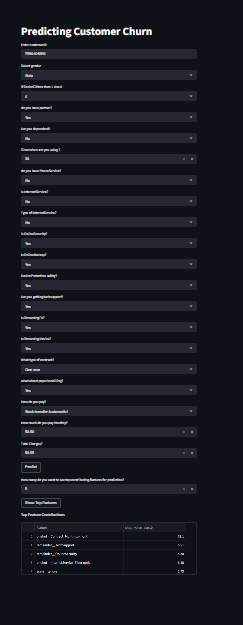

# Telecom Customer Churn Analysis

An end-to-end machine learning application for predicting telecom customer churn. The project combines a trained scikit-learn pipeline, a FastAPI prediction service, a Streamlit interface, SHAP-based feature explanations, and Docker Compose deployment.



## Features

- Customer churn prediction with class probabilities and confidence score
- SHAP-based top feature contributions for each prediction
- FastAPI backend with interactive OpenAPI documentation
- Streamlit web interface for non-technical users
- Docker Compose setup for running the API and UI together
- Jupyter notebooks covering exploration, preprocessing, training, and model export

## Project Structure

```text
api/                       FastAPI application
apps/                      Streamlit application
datasets/                  Source telecom churn dataset
models/                    Trained model pipeline
notebooks/                 Analysis and training notebooks
src/                       Feature engineering and model helpers
DockerFile/                Dockerfiles and build-time Compose configuration
```

## Quick Start With Docker

From the repository root:

```bash
docker compose -f DockerFile/docker-compose.yml up --build
```

Then open:

- Streamlit app: http://localhost:8501
- FastAPI docs: http://localhost:8000/docs
- API health check: http://localhost:8000/health

Stop the services with:

```bash
docker compose -f DockerFile/docker-compose.yml down
```

## Run Locally

Create and activate a virtual environment, then install the dependencies:

```bash
python -m venv .venv
```

Windows PowerShell:

```powershell
.\.venv\Scripts\Activate.ps1
pip install -r requirements.txt
```

Start the API from the repository root:

```bash
uvicorn api.main:app --reload --port 8000
```

In a second terminal, start Streamlit:

```bash
streamlit run apps/streamlit.py
```

For a non-default API location, set `API_URL` before starting Streamlit. For example, in PowerShell:

```powershell
$env:API_URL = "http://127.0.0.1:8000"
```

## API Endpoints

| Method | Endpoint | Purpose |
| --- | --- | --- |
| `GET` | `/` | Service description |
| `GET` | `/health` | Health and model status |
| `POST` | `/predict` | Predict whether a customer will churn |
| `POST` | `/top-features?top_n_feature=5` | Return the most influential features |

The complete request and response schemas are available at `/docs` after starting FastAPI.

## Model and Data

The application loads `models/churn_pipeline.pkl` at startup. The source dataset is stored in `datasets/WA_Fn-UseC_-Telco-Customer-Churn.csv`. The notebooks document exploratory analysis and model development.

## Reproducibility Notes

Serialized scikit-learn models can depend on the Python and package versions used during training. For consistent results, use the pinned versions in `requirements_exactly.txt`, especially when rebuilding the model artifact.

## License

No license has been specified yet. Add a license before accepting external contributions or allowing reuse of this project.